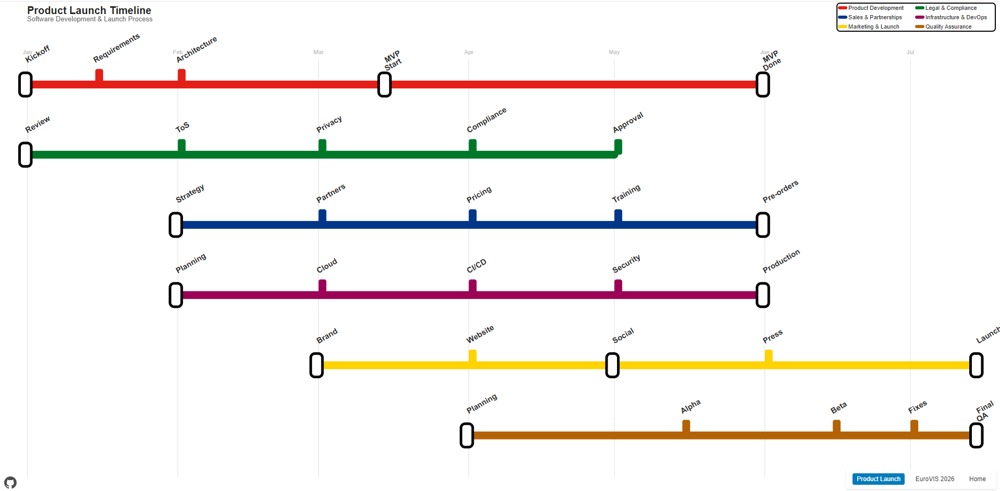

## tube-timeline

London tube style configurable timeline renderer powered by D3 v7. Ships as a tiny ES module you can use directly in the browser or bundle in your app.



This work is heavily inspired by https://velitchko.github.io/eurovis-timeline/, for the EuroVIS 2026.

### Install

Use via script module directly (no build step):

```html
<script type="module">
  import { TubeTimeline } from './src/tube-timeline.js';
  // ... see Usage below
  new TubeTimeline({ target: document.querySelector('svg'), data }).render();
  // d3 v7 must be present globally or passed in via cfg.d3
</script>
```

If publishing to npm, consumers can `npm i tube-timeline` and:

```js
import { TubeTimeline } from 'tube-timeline';
```

### Data shape

```ts
type MilestoneType = 'start'|'end'|'submission'|'notification'|'review'|'abstract'|'invitation'|'cameraReady';
type Milestone = { date: string; name: string; type: MilestoneType; url?: string; label?: string };
type Track = { track: string; label?: string; color: string; dates: Milestone[] };
```

Dates accept `DD/MM/YYYY` or `MM/YYYY`.

### Usage

```js
import { TubeTimeline } from './src/tube-timeline.js';
import * as d3 from 'https://cdn.skypack.dev/d3@7'; // or global <script src="https://d3js.org/d3.v7.min.js"></script>

const timeline = new TubeTimeline({
  target: document.querySelector('svg'),
  data,
  d3,
  options: {
    header: { title: 'My Timeline', subtitle: 'Deadlines', logoHref: 'logo.png' },
    showToday: true,
    orientation: 'auto' // 'horizontal' | 'vertical' | 'auto'
  }
});
timeline.render();
```

### API

- `new TubeTimeline(config)`
  - **target**: SVG element or selector
  - **data**: array of tracks (see Data shape)
  - **d3**: optional d3 instance; if omitted, uses global `d3`
  - **options.header**: `{ title, subtitle, logoHref }`
  - **options.showToday**: show the Today marker (default true)
  - **options.orientation**: `'auto' | 'horizontal' | 'vertical'`
  - **options.onMilestoneClick**: handler `(milestone, track)`; default opens `milestone.url` if present

- `render()` Re-renders responsively; reattaches resize listener
- `destroy()` Clears SVG and removes listeners

### Examples

The library comes with several example implementations:

- **Product Launch Timeline** (`examples/product-launch.html`) - A comprehensive software product development and launch timeline
- **EuroVIS 2026 Conference** (`examples/eurovis-2026.html`) - Academic conference deadlines and tracks
- **Home Demo** (`index.html`) - Interactive demo showcasing the library capabilities

### Demo

Open `index.html` in a static server to see the interactive timeline in action. Navigate between different examples using the navigation menu.

## Examples

### Product Launch Timeline

A comprehensive example showing a software product development lifecycle with multiple parallel tracks:

- **Product Development** - Core development milestones
- **Quality Assurance** - Testing and validation phases  
- **Marketing & Launch** - Brand and promotional activities
- **Sales & Partnerships** - Business development and sales preparation
- **Legal & Compliance** - Legal requirements and approvals
- **Infrastructure & DevOps** - Technical infrastructure setup

### EuroVIS 2026 Conference Timeline


The original academic conference example featuring multiple submission tracks:

- Full Papers, Short Papers, State of the Art Reports
- Panels & Tutorials, Workshops, Education Papers
- Posters & Demos

## Features

- **Multiple Tracks**: Display parallel timelines with distinct colors and labels
- **Interactive Milestones**: Hover tooltips and clickable milestones with optional URLs
- **Responsive Design**: Automatically switches between horizontal and vertical layouts
- **Modular Examples**: Separate HTML files and JSON data for easy customization
- **Today Indicator**: Visual "today" line for current date reference
- **Extensible**: Easy to add new examples and customize existing ones

## Usage

### Basic Setup

```html
<!DOCTYPE html>
<html>
<head>
  <script src="https://d3js.org/d3.v7.min.js"></script>
</head>
<body>
  <svg></svg>
  <script type="module">
    import { TubeTimeline } from './src/tube-timeline.js';
    
    const timeline = new TubeTimeline({
      target: document.querySelector('svg'),
      data: yourData,
      options: {
        header: { title: 'My Timeline', subtitle: 'Description' },
        showToday: true,
        orientation: 'auto'
      }
    });
    timeline.render();
  </script>
</body>
</html>
```

### Data Structure

```javascript
const data = [
  {
    track: 'Track Name',
    label: 'TN', // Short label for display
    color: '#E32017', // Hex color
    dates: [
      {
        date: '01/01/2024', // DD/MM/YYYY or MM/YYYY
        name: 'Milestone Name',
        type: 'start', // See supported types below
        url: 'https://example.com', // Optional
        label: 'Short Label' // Optional
      }
    ]
  }
];
```

### Supported Milestone Types

| Type          | Icon | Description                       |
|---------------|------|---------------------------------|
| start         | 📄   | Beginning or kickoff             |
| abstract      | 📝   | Abstract or planning phase       |
| submission    | 📬   | Submission or delivery           |
| review        | 🔍   | Review or evaluation period      |
| notification  | 📢   | Notification or announcement     |
| cameraReady   | 🖨️   | Final delivery or publication    |
| end           | ✅   | Completion or final milestone    |
| invitation    | ✉️   | Invitation or request            |

## Project Structure

```
tube-timeline/
├── src/

│   └── tube-timeline.js          # Main library


├── examples/
│   ├── data/


│   │   ├── product-launch.json   # Product launch data


│   │   └── eurovis-2026.json     # Conference data


│   ├── product-launch.html       # Product launch example


│   └── eurovis-2026.html         # Conference example


├── index.html                    # Main demo page


├── package.json
└── README.md
```

## Dependencies

- [D3.js v7](https://d3js.org/d3.v7.min.js) for rendering SVG elements and scales


## License

This project is released under the MIT License.

## Author

[](https://github.com/velitchko)  


[](https://github.com/danylaksono)  


Feel free to reach out or follow for updates!


